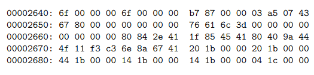
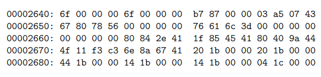
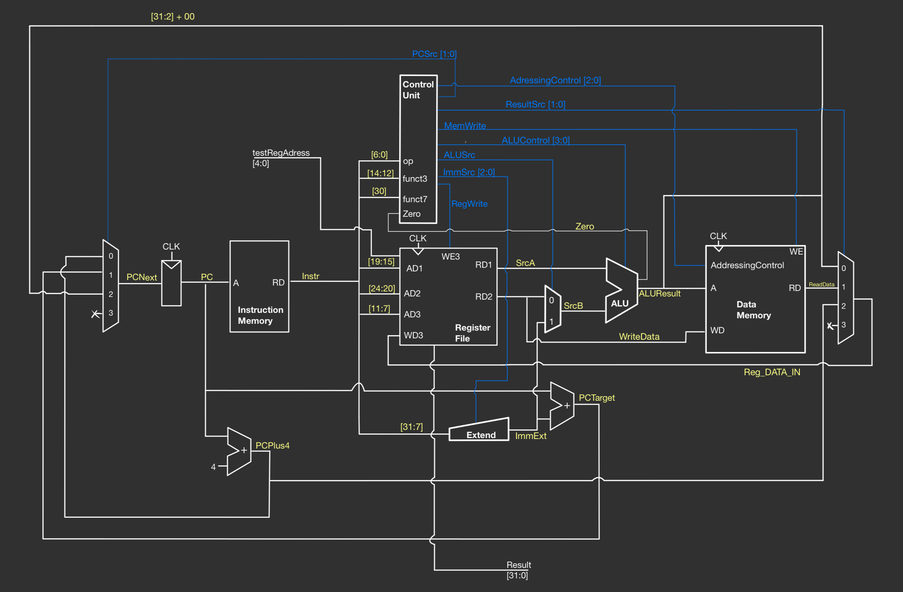

# Team04-RISCV-CPU

## Testing the CPU

- Move into the `testing/Master_test` directory
- There is a shell script called `master_test.sh`
- Run this shell script, and you will see a menu, where you choose the version of CPU you want to run (single cycle / pipelined with cache), and which test to run

In order to view values in a particular register of the CPU, we added a signal `testRegAddress` which is controlled at the top level module, and outputs data from a given register at the signal `testRegData`. This allows use to use register data to view outputs on vbuddy, which is useful for pdf plots and f1 program.

### When testing F1 and pdf:
- Move into the `testing/Master_test` directory
- Choose the `cpu_tb.cpp` test bench using single cycle, and `pipe_cpu_tb.cpp` if testing pipelined cpu 
- Change the `top->testRegAddress` to the register you are insterested in.
- Change the code in the loop to use plotting, vbdBar, or vbd hex display as required.

The rest of the tests don't use vbuddy, and so don't require register changes in the test bench.

## Joint Statement

### Testing videos
These videos show F1 program working for pipelined CPU with data and instruction cache


### Implemented Instructions 
#### R-Type
`add` `sub` `sll` `slt` `sltu` `xor` `srl` `sra` `or` `and`
#### B-Type
`beq` `bne` `blt` `bge` `bgeu` `bltu`
#### I-Type
`addi` `slli` `slti` `sltiu` `xori` `srli` `srai` `ori` `andi` `lb` `lh` `lw` `lbu` `lhu` `jalr`
#### J-Type
`jal`
#### S-Type
`sb` `sh` `sw`
#### U-Type
`lui`
  
*  `blt` `bge` `bgeu` `bltu` have only been implemented in the pipelined version. Single cycle only implements `beq` and `bne`.

## Repo Structure & Logic
```
├───imgs/
│
├───cache/
│
├───rtl/
│
├───rtl_pipelined/
│
├───statements/
│
└───testing
    │   .DS_Store
    │   format_hex.py
    │   real_path.sh
    │   vbuddy.cfg
    │   vbuddy.cpp
    │
    ├───Data cache test/
    │
    ├───F1 program test/
    │
    ├───Pipelined_CPU/
    │
    ├───Ref program test/
    │
    ├───Single_cycle_CPU/
    │
    ├───Test results/
    │
    ├───TestingForPC/
    │
    ├───Type B-J test/
    │
    ├───Type I test/
    │
    ├───Type I-S test/
    │
    └───Type R test/
```

As a team we decided to manage our repo in the following manner:
- Have one main where the current latest finalised and tested implementation of all versions of the cpu are kept in their individual folders
- Once a cpu version has been complemeted merge all relevant branches into the main and then delete all unessecary branches for repo cleanliness before moving onto the next version of the cpu

This method allowed us to have a clear insight into our overall current progress, and keep our repo clean and easily interpreted when viewed for examination. 

## Details & Personal Statements
| Name &nbsp; &nbsp; | Github | CID &nbsp; &nbsp; &nbsp;| Email &nbsp; | Link to Personal Statements|
| -------- | -------- | -------- | -------- | -------- |
| Maximilian | | | | [Max's Statement](statements/Maximilian.md)
| Ilan | [Ilan's github](https://github.com/IlanIwumbwe) | 02211662 | ilan.iwumbwe22@imperial.ac.uk | [Ilan's Statement](statements/Ilan.md) 
| Idrees | | | | [Idrees's Statement](statements/Idrees.md) 
| Hanif | [Xylemeister](https://github.com/Xylemeister)| 02234780 | hhr22@ic.ac.uk | [Hanif's Statement](statements/Hanif.md) 


# Single Cycle RV32I Design
| Component | Maximilian &nbsp; &nbsp; &nbsp; &nbsp; &nbsp; &nbsp; &nbsp; &nbsp;| Ilan &nbsp; &nbsp; &nbsp; &nbsp; &nbsp; &nbsp; &nbsp; &nbsp; &nbsp; &nbsp; &nbsp; &nbsp; &nbsp; &nbsp;| Hanif &nbsp; &nbsp; &nbsp; &nbsp; &nbsp; &nbsp; &nbsp; &nbsp; &nbsp; &nbsp; &nbsp; &nbsp; &nbsp; &nbsp;| Idrees &nbsp; &nbsp; &nbsp; &nbsp; &nbsp; &nbsp; &nbsp; &nbsp; &nbsp; &nbsp; &nbsp; &nbsp;|
| -------- | :--------: | :--------: | :--------: | :--------: |
| alu.sv | C | L | | C
| control.sv | C | | L | C
| data_mem.sv | C | L | C |
| green.sv | | C | L |
| instmem.sv | | L | C |
| master.sv | | C | | L
| orange.sv | | L | |
| P_C.sv | L | | |
| reg_file.sv | | L | |
| sextend.sv | | | L |

Legend: `L` = Lead `C` = Contributor
## Planning

To begin our Single Cycle CPU design we met as a team and outlined the key areas of the design and identified possible issues we might face in our implementation. 

We then created an initial overall logical flow for how our instructions will be intepreted, and drew up our design conventions to ensure compatibilty between individual parts of the CPU we each would proceed to work on.

Responsibilty was then subdivided for parts of the CPU to individual team members and we began working.

## Implementation

### F1 ASM
As a team we produced the following [f1_asm.s](testing/f1_asm.s) code. 

Simulating sequential illumination of Formula 1 start lights, where each light is represented by a bit in a register that is turned on one after another and then turned off after a specified duration.

The program begins execution at the `main` label, where it jumps to the `init` subroutine using `JAL ra, init`, which also saves the return address in the `ra` register. After initializing the necessary registers, the program returns to `main` and loops indefinitely due to the `jal zero, main` instruction.

In the `init` subroutine:
- `s2` is initialized to 0, which will serve as the iterative light control variable.
- `s3` is set to `0xff` (binary `11111111`), representing all lights being on.
- `s5` is initialized to 0 and will hold the result of the bitwise AND operation between `s2` and `s3`.
- `s4` is set to 8, which will act as a countdown timer for the duration the lights are on.

The `loopi` label begins the process of sequentially turning on the lights. `s2` is shifted left by one position and then incremented by 1, simulating the turning on of the next light. The `and` instruction computes the current state of the lights, which is stored in `s5`.

After setting a light, the program enters the `wait` loop, which decrements `s4` until it reaches zero, acting as a delay. Once the countdown is finished, `s4` is reinitialized to the wait value, and if not all lights are on (checked by comparing `s2` and `s3`), the program jumps back to `loopi` to turn on the next light.

Once all lights are on (when `s2` equals `s3`), `s5` is set to 0, turning off all the lights, and the program returns from the `init` subroutine using the `RET` instruction.

### ALU

[Implemented here](rtl/alu.sv)

The ALU contains arithmetic and logic operations on 2 operands. All arithmetic operations needed for all RISCV instructions have been added. Although not all are used. This is in order to make it easy to add instruction implementations in the future if time allows.  
| ALU control | Result |
| -------- | :--------: |
| 0000 | SrcA + SrcB |
| 0001 | SrcA - SrcB | 
| 0010 | SrcA & SrcB |
| 0011 | SrcA or SrcB |
| 0100 | SrcA ^ SrcB |
| 0101 | SrcA < SrcB |
| 0110 | uSrcA < uSrcB |
| 0111 | SrcA << SrcB[4:0] |
| 1000 | SrcA >> SrcB[4:0] |
| 1001 | SrcA >= SrcB |
| 1010 | uSrcA >= uSrcB |
| 1011 | SrcA >>> SrcB[4:0] |
| 1111 | ALUResult = SrcB |

SrcA and SrcB are the 2 inputs to the ALU. SrcB could be an immediate value, this is decided by the ALUSrc signal. *u* prepended to the name means it is treated as an unsigned value. 

There's a `Zero` flag that connects to the control unit, which is high whenever the result from the ALU is zero. This is used for effecting branches.

### PC

---

The Program Counter (PC) module serves to control the instruction flow within the processor. The module includes a register to store the PC and combinational logic to determine the next PC value, labelled `PCNext`.

Inputs to the PC module include:
- `rst`: A reset input that sets the PC to a known start address when activated.
- `clk`: The clock signal that coordinates the updating of the PC register.
- `PCsrc`: A 2-bit signal that selects the next value of the PC.
- `ALUResult`: The output from the ALU for computing jump addresses.
- `ImmEXT`: An immediate value used to calculate the target address for branch instructions.

The `PCNext` value is calculated using a case statement based on the `PCsrc` signal. If `PCsrc` is `00`, the PC is incremented by four for sequential instruction execution. If `PCsrc` is `01`, the PC is set to the sum of the current PC and `ImmEXT`, facilitating immediate branching. If `PCsrc` is `10`, the PC uses the ALU result, aligned to a 4-byte boundary, for jump instructions.

The PC is updated with a sequential `always_ff` block that triggers on the positive edge of the clock or the reset signal. Upon reset, the PC is initialized to `32'hbfc00000`. Otherwise, it takes the value computed as `PCNext`.

This provides the necessary control for sequential execution, branching, and jumping within the processor, supporting our diverse set of instructions.

### Control Unit

The [Control](rtl/control.sv) module, as its name implies, serves to control the flow of data between each module in the processor; this is done by controlling the select signal of multiplexers that are found in between the dfferent modules. In addition, it also sends control signals to the different modules to instruct them which operation does each one of them should perform and which operand should participate in the operation to perform the correct instruction as described by the machine code.

The control unit receives the instruction  from the instruction memory in the form of a 32-bit machine code which it uses to decide which control signal to send to the different modules or multiplexers to ensure the correct operation is being performed by the processor.

These distinct instructions can be uniquely identified by the `opcode`, `funct3` and `funct7` of the machine code from which the control unit based its decision from. 

To implement the control unit, I used the `case` functionality to differentiate the `opcode`, `funct3`, `funct7` and in each instances send different control signals to the rest of the processsor accordingly.

the output control signal is distinct  for different `opcode`, `funct3`,  `funct7`. The control unit in our implementation output the following control signals accordingly to the other modules such that correct operation is performed:

| Control Signal | Function |
| -------- | :--------: |
| `PCsrc` | choose `PC` mode: plus4 (0), immediate (1), ALUresult (2)|
|`ResultSRC`|choose which data to store in the register: ALUresult (0), memory (1), PC (2) |
|`Immsrc`| Choose which bits reconstruction is performed in [sign extend](rtl/sextend.sv) |
| `ALUcontrol`| Choose which type of operation to perform in the ALU as prescribed in ALU section |
| `addressingcontrol`| choose which type of byte reconstruction to perform in data memory for load and store instructions|


### Memory

The single cycle CPU uses data memory, instruction memory, and registers. The [register file](rtl/reg_file.sv) implements 32 32-bit registers, that have synchronous write enable, and asynchronous read. 

The data and instruction memory were initially modelled as 32-bit words per memeory location. This worked well for Lab4 and initially for the project, but not so well when we decided that we wanted to implement all load/store half and byte instructions. A load-store unit was suggested by Max, which would work by masking out relevant bits from a 32-bit word in the case of half / byte addressing. Hanif suggested modelling all memory as a byte per memory location, which would simplify things greatly. Ilan implemented this for the [data memory](rtl/data_mem.sv), and [instruction memory](rtl/instmem.sv). 

Now, byte addressing becomes trivial, half addressing is a matter of accessing 2 consecutive memory locations, and word addressing is a matter of accessing 4 consecutive memory locations. 

Reading and writing to data memory has some subtle caveats.

  
*Acquired  from: https://github.com/johnwinans/rvalp*

Say register `a10` is `0x00002650`.

The instruction `lh x12, -2(a10)` should set `x12` to `0x00004307`. Notice how the word is made up of bytes from higher to lower addresses?

Say `x12 = 0x12345678` then the instruction `sh x12,2(a10)` will change the data at address `0x00002652` from 0x0000 to 0x5678 resulting in

  
*Acquired  from: https://github.com/johnwinans/rvalp*

Using these examples, memory was implmented correctly.

### Testing

GTK wave outputs can go here
 
## Design Decisions

### Control Decoder Table
| Instruction Type | op | RegWrite | ALUSrc | MemWrite | PCSrc | ImmSrc | ResultSrc
| -------- | :--------: | :--------: | :--------: | :--------: | :--------: | :--------: | :--------: 
| R-Type (51) | 0110011 | 1 | 0 | 0 | 00 | xxx | xx
| B-Type (99) | 1100011 | 0 | 0 | 0 | 00/01 | 010 | xx
| I-Type (19) | 0010011 | 1 | 1 | 0 | 00 | 000 | 00
| I-Type (3) | 0000011 | 1 | 1 | 0 | 00 | 000 | 01
| I-Type (103) | 1100111 | 1 | 1 | 0 | 10 | 000 | 10 
| J-Type (111) | 1101111 | 1 | x | 1 | 01 | 011 | 10
| S-Type (35) | 0100011 | 0 | 1 | 1 | 00 | 001 | xx

`AdressingControl` and `ALUControl` Not included as they usually are used to choose case for the Instruction Type being performed 


### Sign Extension
 Immsrc is a control signal produced by the control unit given to the `sextend.sv` module. Its purpose is to reconstruct immediate from the instruction word as each type have their own way of mapping the immediate onto the machine code. This control signal basically tells the `sextend.sv` which type of instruction is currently performed so that the immediate can be extracted accordingly.
 
| ImmSrc| ImmExt | Instruction Type 
| -------- | :--------: | :--------: | 
| 3'b000| {{20{Immediate[31]}}, Immediate[31:20]} | I-type |
| 3'b001| {{20{Immediate[31]}}, Immediate[31:25], Immediate[11:7]}| S-type|
| 3'b010| {{20{Immediate[31]}}, Immediate[7], Immediate[30:25], Immediate[11:8], 1'b0}|  B-type|
| 3'b011| {{12{Immediate[31]}},  Immediate[19:12], Immediate[20], Immediate[30:21], 1'b0} | J-type|
| 3'b100| {Immediate[31:12], 12'b0}| U-type|

### Addressing Control

This control signal is produced by the control unit and is used to choose how we want to construct the bytes onto word in data memory. This is especially useful for instructions such as `lb`, `lh`, `sh`, `sb` where we only want to extract/store a byte or half of the word instead of the entire word.

The addressing control is 3 bits wide, the MSB is to choose between signed or unsigned extension and the remaining bits are used for choosing the different modes and they are allocated for each cases as follows:

| AdddressingControl [1:0] | AddressingControl [2] | Load Instruction type | Store Instruction type |
| -------- | :--------: | :--------: | :--------: |
| 2'b00  | 1'b0 | `lb` | `sb` |
| 2'b00 | 1'b1 |  `lbu` | xx |
| 2'b01 | 1'b0 | `lh` | `sh` |
| 2'b01 | 1'b1 | `lhu` | xx |
| 2'b10 | xx | `lw` | `sw` |

## Final Schematic for Single Cycle CPU



# Pipelined RV32I Design

We also added the rest of the branch instructions that weren't implemented in single cycle

### Contributions
| Component | Maximilian &nbsp; &nbsp; &nbsp; &nbsp; &nbsp; &nbsp; &nbsp; &nbsp;| Ilan &nbsp; &nbsp; &nbsp; &nbsp; &nbsp; &nbsp; &nbsp; &nbsp; &nbsp; &nbsp; &nbsp; &nbsp; &nbsp; &nbsp;| Hanif &nbsp; &nbsp; &nbsp; &nbsp; &nbsp; &nbsp; &nbsp; &nbsp; &nbsp; &nbsp; &nbsp; &nbsp; &nbsp; &nbsp;| Idrees &nbsp; &nbsp; &nbsp; &nbsp; &nbsp; &nbsp; &nbsp; &nbsp; &nbsp; &nbsp; &nbsp; &nbsp;|
| -------- | :--------: | :--------: | :--------: | :--------: |
| PC.sv | | | L |
| alu.sv | | L | | C
| control_unit.sv | L | | | C
| data_mem.sv| | | L | C
| decode.sv | L | | | C
| decode_pipeline.sv | | | L | 
| execute.sv | | L | | C
| execute_pipeline.sv | L | | | C
| extend.sv | L | | |
| fetch.sv | | | L |
| instmem.sv | | | L | C
| memory.sv | | | L | C
| memory_pipeline.sv | | L | | C
| mux.sv | | L | |
| pipelined_cpu.sv | L | L | | C
| register_file.sv | L | | |
| writeback.sv | | L | | C
| writeback_pipeline.sv | | L | | C

Legend: `L` = Lead `C` = Contributor

## Pipelining

The pipeline of each stage is the one to its left.

We decided on this convention since we thought it would be easier to reason about stalling and flushing. Stalling means that the inputs to the stage should not change, while flushing means that the inputs to the stage are zeroed. As such, it made sense to define each pipeline of a stage to be the to its left. 

The hazard unit produces `StallFetch`, `StallDecode`, `FlushExecute`, `FlushDecode`. These are inputs to the relevant pipelines for those stages that need to be flushed or stalled. Inside the pipelined, when stall signal is high, the signals at the pipeline's inputs are not passed to the outputs, while when flush signal is high, the outputs are low. 

Each pipeline is in its own module, and those that are flushed / stalled at some point have internal signals to control that. 
Each stage is in its own module; the inputs to the modul
 are those that are actually used for computing some value in that stage, while those that aren't used are connected directly to the next pipeline in the [top level module](rtl_pipelined/pipelined_cpu.sv). 
## Hazard Unit

The [Hazard unit](./rtl_pipelined/hazard_unit.sv) allows for the pipelined CPU to be able to perform instructions correctly without incurring delays for some special cases to ensure that it is as efficient as possible.

There are 3 different cases that we encountered to posses a challenge to pipelining and might result in an error if not taken care of and those cases are the following:
1. When wwe use a register as an operand that was written to in the previous cycle. (RAW hazard)
2. When we have branch instruction where we only know if we jump or not two cycles later in the execute stage.
3. Load instructions where it takes an extra cycle to load data. 

Thus, to solve these possible issues that the processor might encounter with pipelining we implement the following in our design:
1. Forwarding: allows the value of a register to be used in an operation right after it was written without having to wait for it to go through all the pipelining stages.
2. Stalling: Stalling a stage means to maintain its state. So the inputs to the stage should not change even when the clock ticks. This allows for load instruction to have its values from memory to be loaded into writeback stage so that it could be forwarded onto the execute stage.
3. Flushing: This resets the output of the pipeline flip-flops; This is very useful because for example in the case of branch, we do not know whether to jump or not until the branch instruction is in the execution stage, that means the next instruction in the instruction memory would be loaded onto the decode stage, this would create an error if the jump actually occurs therefore we need to flush the decode stage when jump happens as if the instruction had never been loaded to the decode stage.

All three solutions/operations mentioned above are implemented in our pipelined CPU. Each operation may be used individually or simultaneously for specific cases/instruction. The control signal for forwarding, flush and stall are all produced/controlled by the hazard unit. RAW hazards are mitigated by forwarding from the Writeback or memory stages into the execute stage. If the current instruction in execute stage has a source register that's the same as the destination register as an instruction currently in writeback or memory stage, forward data from writeback or memory stages respectively. We also only forward data from instructions that were going to write to a register. 

Lw issue is solved by stalling the decode and fetch stages. As such, we must flush the execute stage to prevent incorrect data from propagating forward.

If a control hazard is detected, the execute and decode stages are flushed (2 instructions after branch instruction are flushed) before moving to correct instruction. 

# Cache

## Cache specifications

word = 32

| Version | Capacity(words) | Words written at once | Blocks in cache | Blocks / set | Sets
| -------- | :--------: | :--------: | :--------: | :--------: | :--------: |
| Direct mapped | 8 | 1 | 8 | 1 | 8 |
| 2 way assosiative | 8 | 1 | 8 | 2 | 4 |

*Only new components have been considered in this table.*

| Component | Maximilian | Ilan | Hanif | Idrees |
| -------- | :--------: | :--------: | :--------: | :--------: |
| [direct_mapped.sv](cache/direct_mapped.sv) | | C | L |
| [fetch.sv](rtl_pipelined/fetch.sv) (cache version) | | | L |
| [Nway_assos.sv](cache/Nway_assos.sv) | | L | C |

Legend: L = Lead C = Contributor

We implemented cache for instructions and data. Initially, we decided to work out how to get instruction cache to work since it would be easier; we only need to work in one pipelined stage. Once we got that working and tested, we had a go at making data cache work. We implemented 2 system verilog blocks for direct mapped and 2 way assosiative, and reused them in the fetch and execute stages for our instruction cache and data cache respectively.


## Proof that cache is being used


The video above is a screen capture of waveforms produced when CPU with data cache is tested on [the assembly program from lectures](testing/Data%20cache%20test/dcache.asm).

`PCE` shows memory address of the instruction currently in execute stage. We see that `useCacheM` is high when `PCE = 0x10, 0x14, 0x18`. At these points, the instruction in memory stage is each of the lw instructions, and `useCacheM` is high only for lw instructions, so this works as expected. We also see that we get no hits, as expected.


Next we get cache hits for instructions from `0x08 and 0x14`, but `useCacheM` is high only for `PCE = 0x10, 0x14, 0x18`; only the lw instructions. So the hit we get by the branch instruction is meaningless, we only consider hits by the load instructions. 

Running through the loop, we see that this pattern continues until the loop ends.


