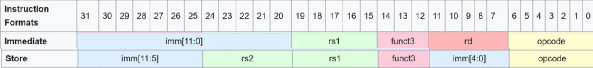
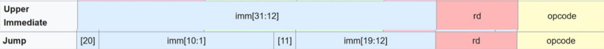

# RISC-V RV32I Processor Coursework

## Personal Statement of Contributions

### __Rasendriya Hanif Rais__

## Sign Extension Unit

[*sextend.sv*](../rtl/sextend.sv)

*Relevant Commits:*

* [Implementation of Sign Extend for I, R and B cases](https://github.com/Arc-Cloud/Team04-RISCV-Proj/commit/cbe43199943c2752a37904b5c7777d30b827ca2b)
* [Implementation of Sign Extend for 4 cases I, S, B, J](https://github.com/Arc-Cloud/Team04-RISCV-Proj/commit/0781e9f1adf3fa9c9c472d8292e0ab73c7fa4016),
* [Implementation of U in Sign Extend](https://github.com/Arc-Cloud/Team04-RISCV-Proj/commit/be7de208dabcd3f9989ebfa8cffc626c69c4cb54)

I made the sign extend unit for our group; In Lab 4, I made one that could only  deal with two types of instructions and during the project I made a version that could handle all the instruction types that requires an immediate.

The sextend unit is very simple to implement, its main purpose is basically to extract the immediate from the instruction word, the catch was that different types of instruction have their own way of keeping the immediate such that the immediate are found at different bit indexes for different types of instruction, the RISC-V ISA has 5 different ways of doing so as shown below.



In addition to reconstructing the bits, as per the RISCV ISA manual, the immediate must also be sign extended to 32-bits.

To satisfy the requirements above, I made [sextend.sv](../rtl/sextend.sv) such that it could select the correct bits from the instruction depending on which instruction is currently performed and concatenate the bits together in the correct order as described above and sign extend the most significant bit. To do this I simply utilized the case statements and implement the correct concatenation for each cases as shown below:

```systemverilog
always_comb begin
    case(ImmSrc)
        3'b000: ImmExt = {{20{Immediate[31]}}, Immediate[31:20]}; // type I
        3'b001: ImmExt = {{20{Immediate[31]}}, Immediate[31:25], Immediate[11:7]}; // type store
        3'b010: ImmExt = {{20{Immediate[31]}}, Immediate[7], Immediate[30:25], Immediate[11:8], 1'b0};// type branch
        3'b011: ImmExt = {{12{Immediate[31]}},  Immediate[19:12], Immediate[20], Immediate[30:21], 1'b0}; //type jump
        3'b100: ImmExt = {Immediate[31:12], 12'b0}; // U instruction
        default: ImmExt = {DATA_WIDTH{1'b0}};
    endcase 
end
```

The `ImmSrc` is a control signal produced by the [Control unit](../rtl/control.sv) that let the sextend module know which type of instruction is being performed and I followed the following convention:

| Type | `ImmSrc` |
|----- | ------- |
| Immediate | 000 |
| Store | 001 |
| Branch | 010|
| Jump | 011 |
| Upper Immediate | 100 |

In the very first versions `ImmSrc` was only two bits as we did not implement upper immediate but then it was changed in later versions to accomodate upper immediate to be performed in the sign extension unit as well.

## Control Unit

[Control.sv](../rtl/control.sv)

*Relevant Commits:*

* [Implementation of control unit for R-type, B-Type, I-type and JAL](https://github.com/Arc-Cloud/Team04-RISCV-Proj/commit/03defa163b3af1b166accd749b617a3707449127)
* [Addition of lw, sw and bitwise operators](https://github.com/Arc-Cloud/Team04-RISCV-Proj/commit/ada9b833a86b291f934370f3cf70ec76bc57b225)
* [Implementation of load and store](https://github.com/Arc-Cloud/Team04-RISCV-Proj/commit/d2785a42b49dc333c872ee61f22d08b457ac8024)
* [Fixed bugs for JARL](https://github.com/Arc-Cloud/Team04-RISCV-Proj/commit/3f8f8b4324a3427c330adbbbdb27c89ae9b179d1)

The control unit is the one that controls the flow of data between each module and in addition to that it also gives instruction to the different modules such as the ALU on which type of operation each of them should do such that in the grand scheme of things the overall operation is aligned with what is described by the instruction (machine code).

To perform this, the control unit outputs control signals to various modules and muxes in the processor to control them and it made this decision based on the instruction word (machine code) that it gets from the instruction memory mainly from the `opcode`, `funct3` and `funct7` section of the instruction word, in addition to that it also takes into consideration the `zero` flag from the ALU for branch type instructions.

As for the control signals, I designed the control unit to produce the following signals:
| Control Signal | Function |
| -------- |------ |
| `RegWrite` | High = Writes to register file |
| `ALUControl` | Chooses operation in ALU |
| `ALUSrc`| choose immediate (1) or register (0) operand |
| `MemWrite` | enable write into the data memory |
| `PCSrc` | set PC: PC = Plus4(0), imm(1), ALUResult (2)|
| `ResultSrc`| choose which data to store to register: Register (0) memory (1) PC (2)|
| `ImmSrc` | choose which sign extend is performed on sextend module|
| `AddressingControl` | Chooses how byte is reconstructed in the data memory output |

It was fairly obvious that the control unit can be easily implemented by using case statements and for each we can have different control signals outputs.

When designing the control unit, I realized that the `opcode` generally divides the instructions into subsets of instructions and in each subset the instruction within shares mostly the same control signals except for some control signal such as `ALUControl` and `AddressingControl` which is further described distinctively by `funct3` and `funct7`. Therefore, to implement the control unit I started with case statement that takes in the `opcode` as argument and in each of the cases I made another case statement that takes in `funct3` as argument and another for `funct7` if necessary. This allows the code for control unit to be more succint.

In the first case statement, I take in the `opcode` as argument and it greatly divides the instruction set into groups as shown below:

### R-type instruction

```systemverilog
 7'b0110011: begin
        RegWrite = 1'b1;
        ALUSrc = 1'b0;
        MemWrite = 1'b0;
        ResultSrc = 2'b00;
        PCSrc = 2'b00;
        
        case(funct3)
            3'b000: begin
                case(funct7)
                    7'b0000000: ALUControl = 4'b0000; //add
                    7'b0100000: ALUControl = 4'b0001; //sub
                endcase
            end
            3'b001: ALUControl = 4'b0111; //sll
            3'b010: ALUControl = 4'b0101; //slt
            3'b011: ALUControl = 4'b0110; // sltu
            3'b100: ALUControl = 4'b0100; //xor
            3'b110: ALUControl = 4'b0011; // or
            3'b111: ALUControl = 4'b0010; //and
            3'b101: begin
                case(funct7)
                    7'b0000000:  ALUControl = 4'b1000; //srl
                    7'b0100000:  ALUControl = 4'b1011; //sra 
                endcase
            end
        endcase
    end
```

The first subset is the R-type instruction, Since I  want to write  onto register therefore I set `RegWrite` to high, and since its register type instruction all the operands are from the register therefore `ALUSrc` is set to zero.

Nothing shall be written onto datamemory therefore I set `MemWrite` to LOW.

As for the `PCSrc` I always set it to `00` except for branch or jump instruction.

`ResultSrc` is set to `00` since we want the `ALUresult` to be written to the register file.

In the R-type subset, it posseses many different type of instructions and they are differentiated by `funct3` or sometime `funct7` so I just made another case statement within the case to differentiate those.

The `ALUControl` signal here tells the ALU which operation they shall perform and the values are chosen as seen in the root [readme](../README.md), which were chosen by Ilan.

### Branch Type Instructions

```systemverilog
7'b1100011: begin
        RegWrite = 1'b0;
        ImmSrc = 3'b010;
        ALUSrc = 1'b0;
        ALUControl = 4'b0001;
        MemWrite = 1'b0;
        case(funct3)
            3'b000: begin
                PCSrc = zero ? 2'b01 : 2'b00; // beq
            end
            3'b001: begin
                PCSrc = zero ? 2'b00 : 2'b01; // bne
            end
        endcase
    end
```

For the B-type instruction, I set `RegWrite` to low since I do not want to write anything to the register.  

For `ALUsrc` it is also set to low since in RISCV the comparison is done between values of two registers.

`ImmSrc` is `010` as previously mentioned in Sign Extend.

Since Ilan wanted to implement `zero` flag such that it is high when the result is zero after substraction (in single-cycle), I set `ALUControl` to `0001` to accomodate for SUB.

In single-cycle we implemented two branch instructions `beq` and `bne` which are differentiated by `funct3` so I made another case statement inside which takes in `funct3`.

In branch I realized that there are two options either to branch or not, if not then PCsrc will be `00` as PC increments as per normal (+4) or whether PC should be added by an immediate, to implement this I used the conditional assignment for PCsrc with the `zero` flag as the condition.

### Load and Store Type Instructions

```systemverilog
 //implementation of I-type (3) instructions (lb, lh, lw, lbu, lhu)
    7'b0000011: begin
        MemWrite = 1'b0;
        RegWrite = 1'b1;
        ImmSrc = 3'b000;
        ALUSrc = 1'b1;
        ALUControl = 4'b0000;   
        ResultSrc = 2'b01;
        PCSrc = 2'b00;
        AddressingControl = funct3;
    end

    //implementation of S-type instructions (35) (sb, sh, sw)
    7'b0100011: begin
        MemWrite = 1'b1;
        RegWrite = 1'b0;
        ImmSrc = 3'b001;
        ALUSrc = 1'b1;
        ALUControl = 4'b0000;
        PCSrc = 2'b00;
        AddressingControl = funct3;
    end
```

Both S and L type instructions have similar logic with the previous instructions and they are very similar to one another as well with the only difference in which module they write onto and how the immediate bits are structured in each.

one distinct feature these two types have is the `AddressingControl` signal, it is a control signal that I personally came up with to control how the datamemory will construct its output word in bytes.

When I was choosing for the values to describe it, instead of having another case statement within that takes in `funct3` I just made `AddressingControl` to be equal to `funct3` because I realized that all the S and L types instructions are already distinctively differentiated by `funct3` alone.

If I could do this all over again I would have implemented it this way for the other types of instructions if possible but in our case this simplification is only found in these two instruction types.

### Jump type instructions

```systemverilog
// JAL
    7'b1101111: begin
        RegWrite = 1'b1;
        ImmSrc = 3'b011;
        MemWrite = 1'b0;
        ResultSrc = 2'b10;
        PCSrc = 2'b01;
    end

//JALR
    7'b1100111: begin
        RegWrite = 1'b1;
        MemWrite = 1'b0;
        ImmSrc = 3'b000;
        ResultSrc = 2'b10;
        PCSrc = 2'b10;
        ALUControl = 4'b0000;
        ALUSrc = 1'b1;
    end
```

For the two jump instructions JAL and JALR, I set `RegWrite` to high since we want to save PC + 4 to register and for the same reason I set `ResultSrc` to `10` since I want to store the `PCnext`.

In JAL `PCSrc` is `01` which is just `PC = Current + Immediate` while in JALR its `10` since in JARL we want to add immediate and pointer value stored in the register therefore `PC = ALUresult`.  

### Immediate type instructions

For the immediate type instruction it has exactly the same logic as that of the register type instruction with the only diffrence being `ALUSrc` to be `1` in Immediate type instruction since we want to do instruction with an immediate.

the `ALUControl` signal of both R-type and I-type can actually be combined into one since they are very similar and if I could do this all over again I would combine I-type and R-type into one case and combine their `ALUcontrol` assignment statements for simplicity.

Single-Cylce Schematic for Reference:


## Instruction Memory

*Relevant Commits*

* [Implementation of ROM for instruction memory](https://github.com/Arc-Cloud/Team04-RISCV-Proj/commit/7119ff8a0e13714c9b1d9c672c36c56a99c6fbc2)

* [implemented the rtl for fetch section of pipelining](https://github.com/Arc-Cloud/Team04-RISCV-Proj/commit/aedca4cb0570de97bfc1f10a5f2e0dad179f7150)

At first I implemented the instruction like we did ROM in the labs which is having an array that takes values from a `.mem` file, has address as input and the dataout as output.

In our latest version we basically have it the same but we loaded words into the `.mem` a bit differently so each index of the array refers only to a byte not the entire word so to extract the entire word we  concatenate the bytes of the current address and the neighbouring addresses up until index address + 3 to extract the full word.

One of the mistakes I did in instruction memory was that I forgot to make it such that its indexed from bfc00fff to  bfc00000, this made our processor fail to run and not output anything to the vbuddy.

## load and store of halves and bytes

[data_mem.sv](../rtl_pipelined/data_mem.sv)

I did not implement this in systemverilog, however, this was my idea and me and Ilan worked together to implement it; full credit for the hardware description to Ilan.

We had two ideas, one was to create another module named `load-store` which basically just takes in the full 32-bit word from datamemory and using some sort of `AddressingControl` and choose how to mask the output bits

However, Having been inspired by the instruction memory my idea was just to have `AddressingControl` straight to the data memory in which we have case statements taking in `AddressingControl` as an argument and in the case statement we have different ways of concatenating the bytes onto word as required.

This way we could easily implement load and store instruction that only requires bytes and halves.

the values chosen for the `AddressingControl` was taken straight from `funct3` of the instruction word.

## Pipelining

*Relevant Commits*

* [Added pipelining for memory](https://github.com/Arc-Cloud/Team04-RISCV-Proj/commit/7f46c6b5bee2bb337a7ebfffa277777ef8697389)
* [implemented the rtl for fetch section of pipelining](https://github.com/Arc-Cloud/Team04-RISCV-Proj/commit/aedca4cb0570de97bfc1f10a5f2e0dad179f7150)
* [changed the implementation of fetch and separate the pipe](https://github.com/Arc-Cloud/Team04-RISCV-Proj/commit/97ccfa6a4b2a106250339ad6872b2f13bd509fcd)

For pipelining I was mostly in charge of connecting the individual section to their pipelines.

In pipelining I did the code for the fetch and memory stage of the pipeline.

At first I combined the flip-flop into the top level module of each stage.

As seen in the first two commits, the pipeline at first was done in the top level module for memory.sv however we decided to have it as a separate module between the stage and the pipeline itself.

Therefore I separated the pipeline from my module in `fetch.sv` and created another module `decodepiped.sv` to differentiate them as demonstrated in the third commit.

## Direct-mapped Cache

[direct_mapped.sv](../rtl_pipelined/direct_mapped.sv)

*Relevant Commits:*

* [low-level implementation of direct caching](https://github.com/Arc-Cloud/Team04-RISCV-Proj/commit/ab218a9971f8df1ea5c656f861d8dfd2f9ca060a)

I did the design for direct-mapped caching,  cache takes in the address of the value (can be PC or others) and see if that value is already stored in the cache

To design the caches, I just created arrays for the diffrent section of a block so for example for valid, tags and data I declared the array as follows:

```systemverilog
logic valids [CACHE_LENGTH-1:0];
logic [TAG_WIDTH-1:0] tags [CACHE_LENGTH-1:0];
logic [DATA_WIDTH-1:0] data [CACHE_LENGTH-1:0];
```

This makes organization simpler rather than having a 60 bits word and having to index each correctly.

The cache has two outputs hit an dataout, dataout is basically just the data that is possesed in the cache and hit is the signal that indicates if a wanted data is contained in the cache or not which goes high if the data exists within the cache.

To implement hit I did the following:

```systemverilog

always_comb begin
    currentSet = address[SET_WIDTH+1:2];
    currentTag = address[DATA_WIDTH-1:DATA_WIDTH-TAG_WIDTH];
    hit = (valids[currentSet] && currentTag == tags[currentSet]);

    if(hit) dataout = data[currentSet];
end
```

I created two logic `currentset` and `currenttag`  which possess the `tags` and the `set` of the address that we are looking for; set is `address[4:2]` and tags are the rest of the most significant bits. I use these two values for indexing the `valids`, `tags` and `data` arrays.

In here hit is implemented such that the `valids` at index `currentset` is HIGH and when `currenttag` is equal to the tags at index `currentset`.

If the data is found then we take the `data` array at index `currentset` and assign it to dataout to be taken to the next stage.

In addition to that cache also needs to allow itself to be written to and to implement this I did the following:

```systemverilog
always_ff @(posedge clk) begin
    if(WE)begin 
        data[currentSet] <= datain;
        valids[currentSet] <= 1;
        tags[currentSet] <= currentTag;
    end
end
```

The main idea of this is basically that when a miss is detected, then `WE` becomes high and at that point the cache writes into `data`, `valids` and `tags` array at index `currentset` with the data from the main memory. If a block is written to then the valids is set to be high to indicate that the set is valid for use.

## Instruction memory cache

*Relevant Commits:*

* [instmem cache implementation](https://github.com/Arc-Cloud/Team04-RISCV-Proj/commit/1c4e55c79be9fad64afca07a384059127c5b3cba)

To implemt caching at the instruction memory stage, I treated the cache module like the instruction memory.

In our implementation cache happens as if it is in parallel to the instruction memory, this may not seem to improve anything but we just want the idea of having cache.

Both instruction memory and cache receives address from the program counter.

The data output of both the instruction memory and the cache are connected to a two-way mux with the `hit` output of the cache as the control signal of the mux.

This is such that if it is a hit then the processor chooses the data from the cache but if it is a miss then it chooses data from the memory.

The `WE` of the cache is connected to `~hit`/`NOT HIT` and `datain` of cache is connected to the output of the memory such that if there is a miss then the data from the memory is written onto the cache.

This way I implemeted the idea of caching onto the instruction memory.

## Additional Special Designs

### JARL

*Relevant Commits*

* [changed Implementation of PCsrc to afford JARL](https://github.com/Arc-Cloud/Team04-RISCV-Proj/commit/ca1c76f268eea3383b1bb69885e0aad3cd598f1a)

In JARL, we want to be able to use pointer and offset therefore we need to have `PC = ALUresult`, one solution was to have PCSrc with two bits to allow 3 input signals but what I did here was that I connect the PCsrc output to another mux with control signal `JARLinstr`. This allows us to have `PC = ALUresult` to accomodate JARL signals.

### Jumps

For all the jump and branch instructions I realized that when I was doing my designs for control-unit that we require register to be able to store `PC` values therefore I improved our lab4 design by adding another bit to `ResultSrc` which would allow PC + 4 to be returned to the register file.

In addition to that for JAL we want to add immediate to our current `PC` and I realized that we did not implement this in lab4 therefore we added an adder that would add the two and feed it back to PCsrc.

## Reflection

I've enjoyed completing the coursework. Throughout, I've developed a deeper understanding of CPUs, particularly those utilizing RISC-V ISA, and hardware design in general. Furthermore, I've gained more experience and am now more confident in using System Verilog, especially when handling multiple modules within larger projects.

Most importantly, I learned how to work in a group format, especially mastering the use of new tools like Github while collaborating within a team. Idrees and Ilan were instrumental in guiding me to become comfortable with Github. They taught me the proper Github etiquette and provided insight into working in a software engineering team and I can't thank them enough.

My biggest dissapointment in the entire project was the fact that I was sick for an entire week and couldn't do more. If I was given the chance to do this all over again I would love to do the hazard unit cause I found it to be interesting and if I had more time I would like to implement spatial locality caching to our CPU.

One thing I would do differently is instead of dividing our tasks by module I believe it would have been better to divide our tasks by insructions instead because when I was working on the control-unit for example I had to wait for others to finalize their designs and their control signals implementation before I was able to finalize my own work. I believe if we had divided the tasks by instructions it would be a lot more efficient and we also get to understand the diffrent parts of the CPU not just the module we worked on. 
