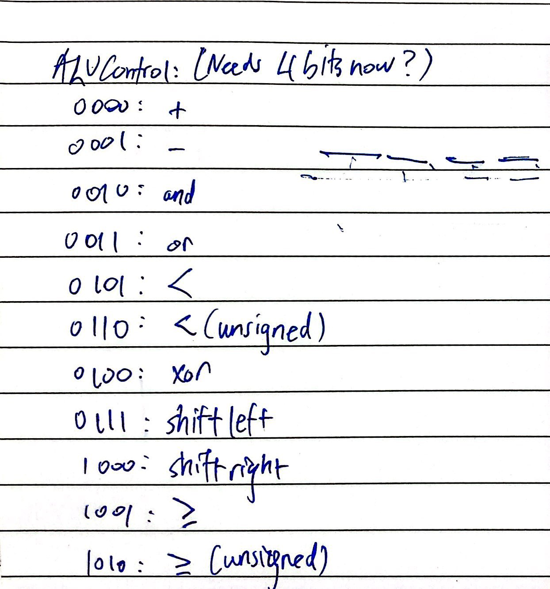
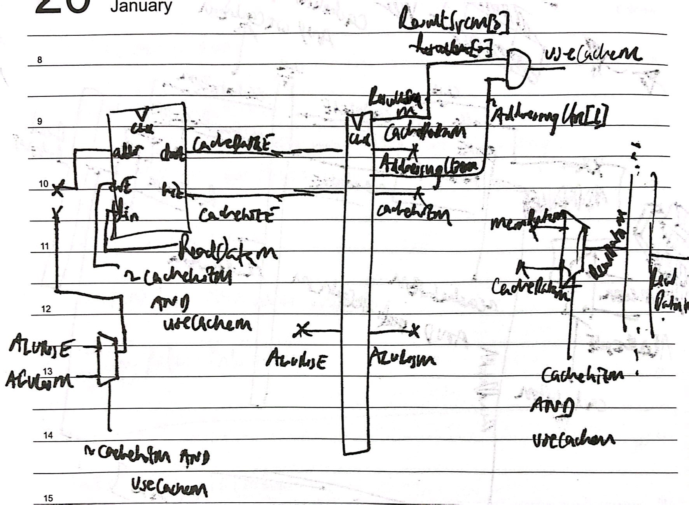

# RISC-V Processor contributions

# Overview
[Single Cycle](#single-cycle-cpu)  
- [ALU](#alu)  
- [Data and instruction memory](#data-and-instruction-memory)  
- [Register file](#register-file)  
- [Others](#others)

[Pipelined CPU](#pipelined-cpu)  
- [ALU](#alu-1)  
- [Execute stage](#execute-stage)  
- [Writeback stage](#writeback-stage)  
- [Pipelines](#writeback-and-memory-pipelines)  
- [Hazard unit](#hazard-unit)  
- [Top level](#top-level)

[Cache](#cache-extension)

[Refletions](#reflections)

## Single cycle CPU

I built the ALU, data memory, instruction memory and register file. 

### ALU 

We wanted to add more instructions and expand upon the 2 we implemented in lab4. As such, the first decision made was to made `ALUControl` 4 bits wide to accomodate for more instructions.



Looking in the [alu block](../rtl/alu.sv), you will notice this:

```C++
    //4'b1100 : ALUResult = SrcA >>> SrcB[4:0]; //srai
    //4'b1101 : ALUResult = SrcA << SrcB[4:0];  // slli
    //4'b1110 : ALUResult = SrcA >> SrcB[4:0];  // srli
```

Initially, I thought that we'd need separate control bits for shift right as an R type instruction and as an I type instruction. However, I realised that we don't need to because by the time `SrcA` and `SrcB` are in the ALU, they are just immediates (either passed by programmer, or obtained from register), the ALU doesn't care. The operation either way is the same, perform the shift where only the least significant 5 bits of `SrcB` are used.

I assigned ALUControl bits arbitrarily, and agreed with Hanif, who built the control unit to use the same convention for instructions that need to use the ALU for some result. 

This implementation has the `Zero` flag go high each time `ALUResult` is zero. At the time, we had this zero bit as input to the control unit, where a branch would be effected for `beq` if it were high, and for `bne` if it were low. This was changed in the pipelined version, since we changed the architecture to use `BranchE` and `JumpE` signals instead as well as the `Zero` flag. This changed is described in more detail later in this document, as well as in the main [README](../README.md#changes-to-existing-modules).

### Data and instruction memory

In lab 4, we had data memory modelled as 32 bit words stored per memory location in our RAM array. When it came to implementing load and store instructions, Max had the idea of building a load store unit which works by loading a full word from memory, then masking out the half-word, or byte needed. It would also work out where in memory to store a byte or word within a word. Hanif had the idea of modelling the memory as bytes per memory location instead. This would make byte addressing trivial, half addressing a matter of addressing 2 consecutive memory locations, and word addressing a matter of addressing 4 consecutive memory locations. I was a proponent of Hanif's idea, since it meant we didn't have to build a new hardware block, reducing complexity. 

I implemented this model for data and instruction memory, where the difference with the latter is that it always loads an entire word from memory.

To make sure we were reading from memory correctly, following the endianness of RISC-V, I [followed the examples here](../README.md#memory).

I also decided to create an `AdressingControl` signal, which would tell the data memory whether to load a byte, half, or word. The first 2 care about sign extension too, which means this signal has to be 3 bits wide to accomodate the 6 possible instructions. This signal isn't needed in instruction memory since we only ever load a full word. 

The `AddressingControl` signals for each instruction is chosen in such a way that in the control unit, we can just set it to `funct3`, which reduces the complexity of the code. Inside the data memory, this signal is split into `addressingmode`(least significant 2 bits) and `signextend`(MSB).  

The memory map says addresses run from 00000 -> 1FFFF = 131071 = 2**17. So the RAM array is chosen to be this size. The address is also cut down to use its least significant 18 bits.

```SystemVerilog
// writing to memory (store instructions)
always_ff @(posedge clk) begin
	if (WE) begin
		case(addressing_mode)
			2'b00 : // byte addressing
				ram_array[addr] <= WD[7:0];
			2'b01 : // half addressing
				begin
					ram_array[addr] <= WD[7:0];
					ram_array[addr+1] <= WD[15:8];
				end
			2'b10:  // word addressing
				begin
					ram_array[addr] <= WD[7:0];
					ram_array[addr+1] <= WD[15:8];
					ram_array[addr+2] <= WD[23:16];
					ram_array[addr+3] <= WD[31:24];
				end
		endcase
	end

end
```

The code snippet above uses the control signal to write to memory as needed, following little endian. 

The instruction memory addresses run from `32'hbfc00fff -> 32'hbfc00000` so 12 bits need to address the entire memory space. 

```SystemVerilog
logic [11:0] addr;

logic [STORAGE_WIDTH-1:0] rom_array [32'hbfc00fff:32'hbfc00000];
```

And it always loads a word

```SystemVerilog
always_comb begin
    addr = A[11:0];
    RD = {rom_array[addr], rom_array[addr+1], rom_array[addr+2], rom_array[addr+3]};
end
```

### Register file

Register file contains 32 32-bit registers, so the address width is 5 bits wide. It is written to on the rising edge of the clock, and read from asynchronously. 

If the destination register is the zero register, 0 is written instead of the input data.

### Others

I had contributions in the top level module, which involved fixing bugs, naming conflicts, and making sure the code would compile and run.

## Pipelined CPU

### ALU

The ALU in pipelined architecture is mostly the same, expect the way the `Zero` flag works is changed such that we can have all the branch instructions.

This is because the architecture was changed such that `PCSrcE = JumpE || (BranchE && ZeroE)`. This means that we want to perform a branch if we have a branch type instruction that passed the branch test from ALU. As such, I reasoned that the `ZeroE` flag should be high if a hypothetical branch test is passed, such that if the executing instruction happens to be a branching instruction, a branch will be performed. 

`blt` example:

```Systemverilog
4'b0101 : begin ALUResult = (SrcA < SrcB) ? 32'd1 : 32'd0; Zero = (ALUResult == 32'd1); end  // blt
```

And `bne` gets its own control signal. It still uses subtraction, but its zero flag goes high if `ALUResult` is non-zero.

```Systemverilog
4'b1100 : begin ALUResult = SrcA - SrcB; Zero = (ALUResult != 32'd0); end  // bne
```
### Execute stage

We decided as a team to make our architure such that each stage is in its own block, as well as each pipeline. Architecute details are explained [here](../README.md#pipelining). I was in charge of building the execute stage. 

I created a mux block (4 input 32-bit) which we use in 3 different places in the architecture.

```Systemverilog
module mux #(
    parameter WIDTH = 32,
    parameter NUM_INPUTS = 4,
    parameter SELECT_BITS = 2
)
(
    input logic [WIDTH-1:0] inputs [0:NUM_INPUTS-1],
    input logic [SELECT_BITS-1:0] select,
    output logic [WIDTH-1:0] outputs
);
    always_comb 
        case(select)
            2'b00: outputs = inputs[0];
            2'b01: outputs = inputs[1];
            2'b10: outputs = inputs[2];
            2'b11: outputs = 32'b0;  // shouldn't be possible
        endcase

endmodule
```

The [execute stage](../rtl_pipelined/execute.sv), as well as the other stages are demarcated such that the module inputs are those that are actually used to compute something, while the rest move directly to the next pipeline register. This meant we could easily debug modules. 

The clock signal was initially not used, since there was no clocked blocks inside this stage, but when I added the [cache block](#cache-extension), this changed.


### Writeback stage

This was simply a multiplexer that chooses which data to write to the register file.

```SystemVerilog
module writeback #(
    parameter DATA_WIDTH = 32,
    parameter NUM_INPUTS = 4
) (
    input logic [1:0] ResultSrcW,
    input logic [DATA_WIDTH-1:0] ALUResultW,
    input logic [DATA_WIDTH-1:0] ReadDataW,
    input logic [DATA_WIDTH-1:0] PCPlus4W,

    output logic [DATA_WIDTH-1:0]  ResultW 
);
    logic [DATA_WIDTH-1:0] MUXW_inputs [0:NUM_INPUTS-1];

    always_comb 
        MUXW_inputs = {ALUResultW, ReadDataW, PCPlus4W, {DATA_WIDTH{1'b0}}};
    
    mux MUXW(
        .inputs(MUXW_inputs),
        .select(ResultSrcW),
        .outputs(ResultW)
    );

endmodule
```

### Writeback and memory pipelines

These simply pass their inputs onto the output signals every rising edge. Since the write back and memory stages are never stalled or flushed, there are no flush or enable signals added.

### Hazard Unit

The [hazard unit](../rtl_pipelined/hazard_unit.sv) is there to deal with 3 main hazards: RAW, load instructions, and control hazard.

RAW hazards happen when data is needed at the execute stage by some instruction but it hasn't been written back to the register file yet. 

Forwarding mitigates this by detecting whether this data is available at the start of the memory stage, or start of writeback stage, and passing it to the execute stage for the current instruction. 

So we need to check whether one of the source registers of the instruction in execute stage is the same as the destination register of an instruction in memory or writeback stage (either one of the 2 instructions above the currently executing instructions). 

There's a caveat:
We only forward if the instruction was actually going to write to a register. This is why we receive bits `RegWriteM` and `RegWriteW`. We only branch if either of these are high for the relevant stage. 

*Why is this important?*
If the instruction wasn't going to write a register, then the data needed by the source register of an instruction in execute stage is probably already there correctly (otherwise programmer would've specified that that register is written to with some value), and if we forward data, it will be wrong data. 

Load intructions take a cycle longer than any other instruction to fully execute. If any of the next 2 instructions need data from a register coming from memory, we cannot forward it. So we stall fetch and decode stages by one cycle to make sure data can be forwarded correctly. We need to flush the execute stage (the stage after the one we stall) to make sure incorrect data doesn't propagate.

Control hazards occur when we don't take a branch yet we should have. 

We know correct branching at execute stage, so if `PCSrcE` is high, we flush the decode and execute stages before fetching the correct instruction.

### Top level

Max and I connected up everything we had built into the top level pipelined cpu block. We tried to make it easy to read and organised. There were naming conflicts and bugs that Idrees fixed on a first pass through. I did a second pass and made the code compile and run.


## Cache extension

We decided to implement instruction cache first, even though it wasn't one of the deliverables. This was because we knew it would be easier to implement, and would possibly guide us on data cache.

I contributed to building the [direct mapped cache](../rtl_pipelined/direct_mapped.sv) with Hanif, and added that to the [fetch](../rtl_pipelined/fetch.sv) stage of the pipelined CPU. 

Once we tested that and knew it worked, I got working on a sketch for how data cache should work:



My reasoning for this is that say we have an instruction in execute stage. The address into data memory will be `ALUResultE`. `cacheDataE   ` and `cacheHitE` store the data got from cache, and whether there was a hit or not. These are pipelined onto the next stage. 

Now, this instruction is in memory stage, so it has to decide whether to search memory, or pipeline cache data instead. If there was a hit, and the instruction can use cache (is an lw instruction), then we can use cache data. 

If there was a miss, `ReadDataM` will be `memDataM`, which is then written to the cache at `ALUResultM` address, which is the correct address for the instruction that caused a miss in cache. 

Write enable for cache is `~cachehitM && useCacheM` (we got a miss for an lw instruction). This same signal also controls the address going into cache. If it is high, the `ALUResultM` address is chosen, and memory data will be written to cache. 

Why just lw instructions? I thought that implementing this for load byte and half would get too complex, and at this point we had 2 days left. Imagine, that a load byte instruction is executed, and there's a miss. We load a byte of data from memory, then place it in cache. Next time, say we have `lh` from the same memory address. We will get a hit, but the data in cache will actually be wrong. 

So maybe let's always read a full word from memory, store that in cache, then mask out the part we need. This would mean changing data memory, such that no matter what, it always loads the full word, then masks out the parts needed for memory output, but passes the full word to be written to cache. This is getting into load store unit territory, and would require quite a significant overhaul of the architecture. 

The cache is also build such that only loads are considered, storing is only ever done directly to memory. We do get that first miss we can't avoid on the first check in cache, but this isn't too bad when we use 2 way cache, and can be further improved with spatial locality builds, although we did not do the latter. 

In the end, we have a cache block which can only be loaded from by `lw` instructions. [Here is proof it actually works](../README.md#proof-that-cache-is-being-used).

First, I added direct mapped cache block to the execute stage, and tested that, with positive results, then integrated [2 way assosiative cache](../rtl_pipelined/Nway_assos.sv) soon after.

## Reflections

I had a lot of fun building this CPU. I learnt a ton about hardware design in system verilog, computer architecture, and instruction set architecture. Additionally I learnt what it meant to work in a team, and how to maximise success by working together, being communicative, and clear with the goals you want to achieve. Excited to build the compiler next year!