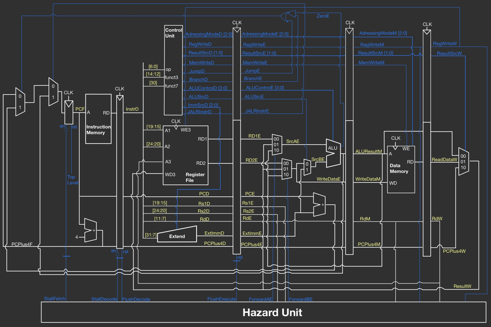

# Maximilian's Personal Statement

**CID:** 02286647  
**GitHub Username:** Arc-Cloud


_Implemented_
- **Single Cycle CPU**
    - [Program Counter](../rtl/P_C.sv)
- **Pipelined CPU**
    - [Control Unit](../rtl_pipelined/control_unit.sv)
    - [Decode Block](../rtl_pipelined/decode.sv)
    - [Execute Pipeline](../rtl_pipelined/execute_pipeline.sv)
    - [Sign Extend](../rtl_pipelined/extend.sv)
    - [Register File](../rtl_pipelined/register_file.sv)
    - [Top level Pipelined CPU](../rtl_pipelined/pipelined_cpu.sv)

_Contributed and Debugged_
- **Single Cycle CPU**
    - [ALU](../rtl/alu.sv)
    - [Control Unit](../rtl/control.sv)
    - [Data Memory](../rtl/data_mem.sv)

- **Pipelined CPU**
    - [Memory Pipeline](../rtl_pipelined/memory_pipeline.sv)

_I was also responsible for drawing all schematics_


## Work Done on Single Cycle CPU

**Superscript numbers contain links to the relevant commit**


### Program Counter
I Led the coding of the [Program Counter](../rtl/P_C.sv)<sup>[1](https://github.com/Arc-Cloud/Team04-RISCV-Proj/commits/5f1035bc690de260ca8776ba0ff26a439735f1da)</sup>, keeping careful consideration of timing and data flow to ensure accurate instruction sequencing was implemented throughout the CPU. A description of the module which I have written can be [found](../README.md/#pc) in the README.

### ALU
For the [Arithmetic Logic Unit](../README.md/#alu) (ALU), I helped to implement the logic behind the shifting instructions<sup>[2](https://github.com/Arc-Cloud/Team04-RISCV-Proj/commits/d861fdb532131bee728830dab0a2583f5b4bb8ac)</sup>, as well as defining the effect of the ALU control signal. This required understanding of binary arithmetic and logic operations.

### Control Unit
I contributed to the design and implementation of the [Control Unit](../README.md/#control-unit), where I introduced the [organised](../rtl/control.sv) structure<sup>[3](https://github.com/Arc-Cloud/Team04-RISCV-Proj/commits/b7304164e964b4510e0f6e5626252b3b846c7f4e)</sup> of the unit, split by instruction type. And proposed the use of funct3 for AdressingControl to prevent unnecessary complexity. The [Control Decoder Table](../README.md/#control-decoder-table) was then written by me<sup>[4](https://github.com/Arc-Cloud/Team04-RISCV-Proj/commits/5c671a0f0f0658a465c100a5ae0c9700c2dc17f3)</sup>.   

### Data Memory
I also participated in developing the [Data Memory](../README.md/#memory) module, In how `LW` `LH` `LB` `SW` `SH` `SB` are implemented. 

I did this through initially designing a load store unit to manage memory interactions within a singular clock cycle. It would interpret the load and store instructions, calculating the target memory addresses by combining base addresses from CPU registers with immediate values from the instruction. 

For load operations, the LSU would retrieve data from memory to send to CPU registers, whereas for store operations, it would write data from the registers to specified memory locations. 

The LSU would also include mechanisms for error checking, such as detecting invalid memory addresses or handling permissions for read/write operations.

However after conversation with Ilan we decided it was unnecessary due to the limited complexity of our CPU so we therefore decided to implement all required functionality in Data Memory through the use of AdressingControl.

### Schematic
 
 

## Work Done on Pipelined CPU

### Decode Block
I was responsible for the implementation of the Decode Block<sup>[5](https://github.com/Arc-Cloud/Team04-RISCV-Proj/commits/5bcc1413d680a26ff638a1ce9f6d9b4e19436818)</sup>, Integrating The Register File, Control Unit and Sign Extend Blocks to prepare them for pipelining. The module's primary function is to interpret and translate the binary instruction data (`instrD`) into specific control signals and operational codes, which guide the subsequent stages of instruction execution. 

Initially the module extracts critical information from the instruction data, and assigns addresses `Rs1D`, `Rs2D`, `RdD`, by parsing specific bits of the instruction.
```systemverilog 
always_comb begin
    Rs1D = instrD [19:15];
    Rs2D = instrD [24:20];
    RdD = instrD[11:7];
end
```

#### Register File
The Decode module interfaces with the [register_file](../rtl_pipelined/register_file.sv) sub-module to manage CPU register operations, including reading register values and facilitating write-backs. 

_Changes Made to the Register File_:
I reviewed the original implementation of the [register file](../rtl/reg_file.sv) ensuring it was able to interface correctly with the new pipelined cpu and confirmed the existing logic<sup>[6](https://github.com/Arc-Cloud/Team04-RISCV-Proj/commits/e5769d5e5bcdc0f51bed019106f480e7071da6cd)</sup>. 


#### Control Unit

Through the [control_unit](../rtl_pipelined/control_unit.sv) sub-module, Decode produces various control signals (RegWriteD, ResultSrcD, MemWriteD, JumpD, etc.) that dictate the operation of other processor components.

_Changes made to the Control Unit_: I enhanced the [Control Unit](../rtl_pipelined/control_unit.sv) in the Pipelined CPU<sup>[6](https://github.com/Arc-Cloud/Team04-RISCV-Proj/commits/e5769d5e5bcdc0f51bed019106f480e7071da6cd)</sup> to handle more instruction sets and control logic. Implementing JALRInstrD and expanding the number of branch instructions, while also cleaning up and improving existing logic control such as in the use of funct7. All changes stated in the [README](../README.md/#control-unit-pipelined). 


#### Sign Extend

Utilizing the [extend](../rtl_pipelined/extend.sv) sub-module, the Decode module handles the sign-extension of immediate values from the instruction, used for certain arithmetic and memory operations.

_Changes made to Sign Extend_: For the pipelined [sign extend](../rtl_pipelined/extend.sv) block I introduced compatibility<sup>[6](https://github.com/Arc-Cloud/Team04-RISCV-Proj/commits/e5769d5e5bcdc0f51bed019106f480e7071da6cd)</sup> so that it could interact with the rest of the pipelined cpu design. And also discussed with the rest of the team how we would address the bits of the Immediate Input to the block within sign extend before settling on having the bits retain their same index as from InstrD.

#### Execute pipeline
 I then created the interface for the decode block to interact with the execute block seen in the [Execute Pipeline](../rtl_pipelined/execute_pipeline.sv) module<sup>[5](https://github.com/Arc-Cloud/Team04-RISCV-Proj/commits/5bcc1413d680a26ff638a1ce9f6d9b4e19436818)</sup> which serves as a buffer and control point between the decode and execute stages of the pipelined CPU. It ensures that the instructions and data decoded in the Decode stage are correctly passed to the Execution stage in a controlled, clock-synchronized manner. This is crucial for maintaining the integrity and order of our operations in the pipelined CPU, where multiple instructions are processed in different stages of the pipeline simultaneously.


### Top Level Pipelined CPU
I collaboratively implemented the [Top Level Pipelined CPU](../rtl_pipelined/pipelined_cpu.sv) <sup>[7](https://github.com/Arc-Cloud/Team04-RISCV-Proj/commits/b25d41d3b54a6e7d73d05234c3feaa0290ed629b)</sup> with Ilan, integrating all modules cohesively, ensuring efficient and error-free operation.

Here is a summary of the functionality that the top level pipelined CPU implements:

1. **Module Definition and Parameters**: 
   - The `pipelined_cpu` module is defined with parameters `DATA_WIDTH` and `REG_FILE_ADDRESS_WIDTH` to configure the data size and register file address width.
   - Inputs include the clock (`clk`), reset signal (`rst`), and a test register address.
   - Outputs are the data from the test register and the final result from the write-back stage.

2. **Fetch Stage**:
   - This stage involves the `fetch` module that handles instruction fetching.
   - Inputs include clock, reset, control signals, and addresses for jumps and branches.
   - Outputs are the fetched instruction, the incremented program counter, and the current program counter value.

3. **Decode Pipeline**:
   - The `decode_pipeline` module transfers data from the fetch to the decode stage.
   - It handles pipeline registers between these stages and deals with stalling and flushing mechanisms.

4. **Decode Stage**:
   - In the `decode` module, the fetched instruction is decoded.
   - It outputs control signals for the execution stage, the operands for the ALU, immediate values, and register addresses.

5. **Execute Pipeline**:
   - The `execute_pipeline` module passes decoded instructions and data to the execute stage.
   - It deals with flushing and control signals.

6. **Execute Stage**:
   - The `execute` module performs the actual computation.
   - It includes ALU operations, branch/jump calculations, and forwarding logic.
   - Outputs include the ALU result, PCSrc, and write data for memory access.

7. **Memory Pipeline**:
   - This pipeline stage, implemented in the `memory_pipeline` module, handles the transition of data from the execute to the memory stage.

8. **Memory Stage**:
   - In the `memory` module, memory operations such as load and store are performed.
   - It interacts with the data memory and computes the final data to be written back.

9. **WriteBack Pipeline**:
   - The `writeback_pipeline` module passes data from the memory to the write-back stage.
   - It handles register file write-back operations based on control signals.

10. **WriteBack Stage**:
    - The `writeback` module finalizes the instruction execution by writing results back to the register file.

11. **Hazard Unit**:
    - The `hazard_unit` module manages data hazards and controls stalling and flushing of the pipeline stages.
    - It ensures correct data forwarding and synchronization between different stages.

### Schematic


## Work Done on Cache
While not directly contributing any code to the implementation of cache, drawing the schematic and verifying its logical process through conversation with the team was useful in creating a working integrated cache.
### Schematic


## Other Contributions
I created the framework of our README And led the coding of f1.asm and created its description seen in the following commits:
[8](https://github.com/Arc-Cloud/Team04-RISCV-Proj/commits/9c487c29144cf572a1b67e35f636123b264c375b), [9](https://github.com/Arc-Cloud/Team04-RISCV-Proj/commits/8fb2a4d648fda2bdb002b33cea8b1fe7121b8a33), [10](https://github.com/Arc-Cloud/Team04-RISCV-Proj/commits/d2e772085d20a716ab273c6f69292b86d74e990b),
[11](https://github.com/Arc-Cloud/Team04-RISCV-Proj/commits/d71f6f6fe4873a319c10c4ee971d90eba620fc2b)

## Special Design Decisions
### Single Cycle
- The possibility of using a Load Store Unit to implement store and load instructions was proposed by me, however after reviewing options with the rest of the team the decision was made to implement load and store functionality in the [data memory block](../rtl/data_mem.sv). Negating the need for a load store unit in our design. 
- After planning the single cycle cpu design with the team  we created the structure seen in [master.sv](../rtl/master.sv). These are the reasons we decided on such an implementation:

    - **Unified Control Path**: Our design uses modules like [green](../rtl/green.sv) and [orange](../rtl/orange.sv) to handle the control unit, instruction memory, ALU operations, and data memory interactions. This integration streamlines the control flow and data path within the CPU.
    - **Modularity**: Despite being a single-cycle design, the CPU maintains a modular structure. The [P_C](../rtl//P_C.sv) module manages the program counter and instruction fetching, [green](../rtl/green.sv) handles instruction decoding and control signal generation, and [orange](../rtl/orange.sv) deals with execution, including ALU operations and memory access.
    - **Control Signals**: Centralized control signals (`PCSrc`, `ResultSrc`, `MemWrite`, `ALUControl`, `ALUSrc`, `RegWrite`) manage the flow of data and the type of operation to be performed, ensuring that each instruction is executed correctly and efficiently.
    - **Parameterization**: Parameters like `DATA_WIDTH` and `ADDR_WIDTH` allowed the CPU to be easily configured for different requirements, promoting reusability and adaptability.
    - **Testing and Debugging**: including a test register address input (`testRegAddress`) and a corresponding result output (`Result`) facilitated easy testing and debugging of the CPU.

### Pipelining

- One design decision we took for pipelining is implementing JALR through the use of the JALRInstr signal as JALR requires specific address calculations and affects branch prediction. The `JALRInstr` signal helps in managing these aspects efficiently within the pipeline, especially in the decode and execute stages. Also given that JALR affects the program counter (PC), the `JALRInstr` signal is essential for synchronizing the PC updates across different pipeline stages, ensuring correct program execution flow.

- Through proposing my ideas and in discussion with the team the pipelined CPU was implemented as according to the schema seen [above](#top-level-pipelined-cpu). The rationale behind our implementation is the following:
    - **Modularity**: The use of separate modules for each pipeline stage ([fetch](../rtl_pipelined/fetch.sv), [decode](../rtl_pipelined/decode.sv), [execute](../rtl_pipelined/execute.sv), [memory](../rtl_pipelined/memory.sv), [writeback](../rtl_pipelined/memory.sv) and sub-components (like [hazard_unit](../rtl_pipelined/hazard_unit.sv)) enhances readability, maintainability, and scalability of the design. This approach allowed for easier debugging and potential future enhancements.
    - **Parameterization**: The use of parameters such as `DATA_WIDTH` and `REG_FILE_ADDRESS_WIDTH` offered flexibility in adapting the CPU to different requirements, such as varying data sizes or register file configurations. This made the design more versatile and adaptable to different applications.
    - **Pipeline Stages**: Dividing the CPU operations into distinct stages (fetch, decode, execute, memory, write-back) allowed for instruction-level parallelism, significantly improving throughput. Each stage is designed to perform specific tasks, which can be executed concurrently in a pipelined manner.
    - **Pipeline Registers**: The inclusion of pipeline registers ([decode_pipeline](../rtl_pipelined/decode_pipeline.sv), [execute_pipeline](../rtl_pipelined/execute_pipeline.sv), [memory_pipeline](../rtl_pipelined/memory_pipeline.sv), [writeback_pipeline](../rtl_pipelined/writeback_pipeline.sv)) between each stage helped in isolating the stages and ensured smooth data flow across the pipeline. This was crucial for maintaining a consistent and uninterrupted instruction flow.
    - **Forwarding and Control Logic**: The logic for forwarding (e.g., `ForwardAE`, `ForwardBE`) and various control signals (like `RegWrite`, `MemWrite`, `ALUSrc`) ensure that the correct data is used at each stage of the pipeline. This minimizes the delays typically associated with pipeline hazards.
    - **Branch and Jump Handling**: The design also accommodates efficient handling of branches and jumps (`PCSrcE`, `PCTargetE`), which are critical for the performance of control flow instructions in our CPU.


## Reflection

### What I Learned
This project was a rich learning experience for me, teaching me many knew concepts while also allowing me to develop some of my existing skills. 

The major improvements I have made personally have been in:
#### System Verilog
Through the modules I have created, contributed towards and debugged throughout this project I believe my fluency with system verilog has greatly increased, this can most definitively be seen in the creation of the top level [pipelined cpu](../rtl_pipelined/pipelined_cpu.sv), where I integrated my knowledge of all existing modules, achieving effective macro communication.

#### Instruction Set Architectures
Throughout this project my understanding of the RISCV architecture has been constantly improving.
- Single Cycle CPU
    - **Understanding Control Logic**: I got a much clearer picture of how control logic works inside a CPU. Understanding the orchestration of different control signals in response to various instructions.
    - **Learning Instruction Decoding**: Also learning how to decipher instruction words and figuring out how to assign their bits based on the instruction type.
    - **Understanding Jump Instruction Mechanics**: Figuring out how jump instructions function, especially their interactions with the program counter and registers. and how these instructions drive the CPU's execution flow.
    - **Memory Instructions**: Implementing load and store instructions showed me how a RISC-V CPU manages data transactions between memory and registers.
    - **Testing and Refinement**: The process of testing and refining the CPU design was both challenging and rewarding. It taught me the importance of a systematic approach in troubleshooting and improving a design, ensuring both functionality and efficiency.
    - **Reinforcing Knowledge**:  Building the single-cycle CPU helped me solidify the concepts I learned in lectures. Allowing me to see how these ideas come to life in actual CPU design.

- Pipelined CPU
    - **Pipeline Architecture Understanding**: I gained insights into how breaking down CPU operations into stages can enhance performance through parallel instruction processing.
    - **Hazard Management**: Also learned about the challenges of managing data hazards and dependencies, necessitating careful control logic and data flow.
    - **RISC-V Instruction Set Implementation**: I deepened my understanding of the impact of instruction design on CPU architecture, especially with specialized instructions like JALR.
    - **Design Modularity**: I realised the importance of modular design in making complex CPU architecture more manageable and understandable.
    - **Practical Application of Lectures**: The pipelining part of the project also served as a practical exercise in applying theoretical concepts, leading me to an improved understanding of CPU design challenges.
- Cache
    - While I didn't directly contribute any code to the creation of the cache, creating the schematic allowed me to form a clear understanding of how it operates and integrates with the rest of the pipelined cpu: 
        - Cache stores copies of data from frequently used main memory locations. 
        - When the processor needs to access data, it first checks the cache. 
        - If the data is there (a 'hit'), it can be accessed quickly. 
        - If the data is not in the cache (a 'miss'), it's retrieved from slower main memory and also stored in the cache for future access (it can be evicted if not used again for a while). 
        - This process speeds up data access, making the cpu faster.

#### Git
Using git in this project to manage our shared repo was extremely useful and informative. Giving me a strong foundation for future project work in how to properly manage branches and maintaining the integrity of the main. 

Also learning how it can be used to ensure projects are not lost due to improper merges, through reflog. And other interesting functionalities such as log, tree and amend.

#### Markdown
This project has also shown me the great versatility of markdown, and how it can be used to effectively communicate what you are try to show. 

Learning how to link jumps within a repo, format tables, insert images and video, have a clear structure using headers, partially integrate with html and more.

#### Teamwork
Teamwork was definitely the most integral part to our completion of this project, without every member working so well together it wouldn't have been possible to achieve all of our goals.

I believe I have definitely improved my team-working skills through this project. Improving my ability to:
 - Better communicate ideas
 - Reference other people's ideas before just going ahead with implementation
 - Reach out to others to have a clear understanding of the project as a whole and in what direction it is heading
 - Get and give motivation to the rest of the team to maintain progress
 - And enjoy working together to get the best result  

### Improvements
There are definitely opportunities for further optimization of our the CPU design. Some of the more interesting topics I would like to have looked into if given more time are:

   - Implement **cache hierarchies** (L1, L2, L3) with different levels of cache having varying sizes and speeds.
   - Use **cache prefetching** strategies like spacial and temporal locality to anticipate data/instruction needs and reduce access times.
   - Enhance the **branch prediction algorithm** (e.g., maybe using a more sophisticated dynamic predictor) to improve prediction accuracy and reduce stalls.
   - Implement **speculative execution** to execute instructions ahead of branch resolution, rolling back if the prediction is incorrect.
   - Explore **out-of-order execution** to allow instructions behind a stalled instruction to proceed, increasing utilization of pipeline stages.
   - Introduce **superscalar architecture** capabilities, enabling multiple instructions to be issued and executed in parallel.
   - Optimize **pipeline depth**, balancing between the complexity and potential speedup.
   - Add support for **new instruction sets or extensions** (like vector operations or floating-point operations) to handle a broader range of applications efficiently.
   - Implement **custom instructions** tailored for a specific application (like cryptography or signal processing).
   - Integrate **hardware accelerators** for specific tasks (like encryption, graphics processing) that work in tandem with the CPU.
   - Introduce **error-correcting code (ECC) memory** support to detect and correct data corruption.
   - Implement **redundancy and checkpointing mechanisms** for critical operations to enhance reliability.
   - Move the design towards a **multi-core system**, enabling parallel processing and better handling of multi-threaded applications.
   - Implement **inter-core communication mechanisms** and shared caches for efficient data sharing and synchronization between cores.

Each of these improvements would come with trade-offs in terms of complexity and cost. I would also need to research further to optimise the choice of enhancements dependant on what would be the desired use case for our CPU design.


### Mistakes
Mistakes are inevitably part of any piece of work but I believe we did very well to limit the number we made through careful planning and communication. However initially I did make some errors which I hope to not repeat in the future:
- Immediately jumping to implementation of an idea or module
- Not being rigorous with understanding the implications a commit might have to the rest of the project
- Not fully planning out what to do once initial objectives have been achieved
- Not writing thorough test cases for all key modules 


### Takeaways
From mistakes that I have made and experienced along with everything learnt throughout the project these are my key takeaways from our project:
- Do not immediately jump to implementation of a module or idea. Ensure your thinking is sound and confer with everyone in the team beforehand to confirm whether a module or idea will integrate well with the rest of the design.
- If you are doing a large commit that might affect large parts of the repository always confer with others to make sure you understand the implications it might have
- Always ensure everyone has something to work on and are not unsure with what they should be doing, and aim to have a larger picture in your mind of where the project currently is and what would be the best next steps to take.
- Be thorough with testing and be aware of as many edge cases as possible. However do not go overboard and waste time writing tests that check functionality that will never be used.
- It can be helpful to have multiple people look over the same work, rather than isolate everyone from one another. As having someone come in fresh to check something can highlight bugs and lead to much faster improvement, while also allowing each person to better understand the project as a whole.
- Read and thoroughly understand the project brief before anything else, to create a strong foundation for the project to go off of.


_Thank you for arranging this project it was a lot of fun_

## Commit Appendix

| Commit ID | Date | Commit Description |
| -------- | :--------:| :--------: |
| b6088fb | 2023-12-15 | Merge pull request #57 from Arc-Cloud/ReadMeMaxEdits|
| bc57764 | 2023-12-15 | Merge pull request #56 from Arc-Cloud/ReadMeMaxEdits|
| 3fe1022 | 2023-12-15 | Merge pull request #54 from Arc-Cloud/ReadMeMaxEdits|
| 7cd5129 | 2023-12-14 | Merge pull request #49 from Arc-Cloud/ReadMeMaxEdits|
| 7cc9409 | 2023-12-14 | Update README.md|
| 50e7b4b | 2023-12-14 | Link to PC|
| 8df2465 | 2023-12-14 | Made Pipelined Schematic Visible + Added Personal Details|
| 84ba9b2 | 2023-12-14 | Merge pull request #48 from Arc-Cloud/ReadmeEditsMax|
| 11819ba | 2023-12-11 | Updated f1 asm description|
| 3053fdb | 2023-12-11 | Added logic for repo management|
| 5c671a0 | 2023-12-11 | Made overall decoder table + Updated repo structure|
| 2d63094 | 2023-12-06 | Corrected contributions table|
| 171a524 | 2023-12-06 | Added corrected single cycle schematic|
| 8ebb2c7 | 2023-12-06 | Add files via upload|
| 31ef348 | 2023-12-06 | Update contributions|
| b25d41d | 2023-12-06 | Merge pull request #36 from Arc-Cloud/pipelined-cpu|
| a6dcf3d | 2023-12-06 | Update and rename decodepiped.sv to decode_pipeline.sv|
| 32a600f | 2023-12-06 | Update and rename executepiped.sv to execute_pipeline.sv|
| 8cddf3d | 2023-12-06 | Update and rename memory_pipeline_reg.sv to memory_pipeline.sv|
| 5bcc141 | 2023-12-06 | Merge pull request #35 from Arc-Cloud/pipeline-decode|
| 86d1fdd | 2023-12-04 | updated contributions for pipeline|
| e5769d5 | 2023-12-04 | Merge pull request #27 from Arc-Cloud/pipeline-decode|
| d2e7720 | 2023-12-03 | Improved F1ASM Description|
| f65c507 | 2023-12-03 | Added Readme for PC|
| 43d1f30 | 2023-12-03 | Added Single Cycle Schematic|
| d861fdb | 2023-11-30 | Inital Shifting|
| c832da1 | 2023-11-30 | Inital Shifting|
| d174748 | 2023-11-30 | Update README.md|
| 8fb2a4d | 2023-11-30 | Provided Outline For Single Cycle assessment|
| 5daac78 | 2023-11-30 | Update control.sv|
| 0fdb0ba | 2023-11-30 | Update README.md|
| f76930d | 2023-11-29 | Update README.md|
| 37132cf | 2023-11-27 | Merge pull request #18 from Arc-Cloud/Load-Store-Unit|
| 297cd76 | 2023-11-27 | Introduced Universal Naming convention fully|
| 6f70acf | 2023-11-27 | Introduced Universal Naming convention|
| 9088832 | 2023-11-27 | Update README.md|
| 9c487c2 | 2023-11-27 | Update README.md|
| fcd00c4 | 2023-11-27 | Merge pull request #17 from Arc-Cloud/Load-Store-Unit|
| 0422433 | 2023-11-27 | added statement folder|
| e617c37 | 2023-11-27 | Merge branch 'main' of https://github.com/Arc-Cloud/Team04-RISCV-Proj into Load-Store| 
| 1609042 | 2023-11-27 | Update README.md|
| b730416 | 2023-11-27 | Cleaned up control.sv a bit, created inital load store unit idea|
| 825cb81 | 2023-11-23 | Update README.md|
| 46d68c8 | 2023-11-23 | Update README.md|
| c3ce628 | 2023-11-23 | Renamed all PC signals as according to image in project brief|
| 0ddf0ef | 2023-11-23 | changed name for branch input from IMMOP to IMMEXT for more accuracy|
| 5f1035b | 2023-11-23 | Added PC and PC testing|
| d0c87bd | 2023-11-23 | Initial commit|